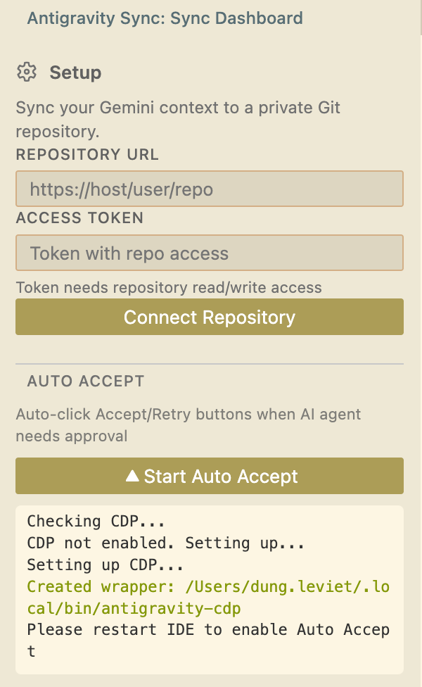
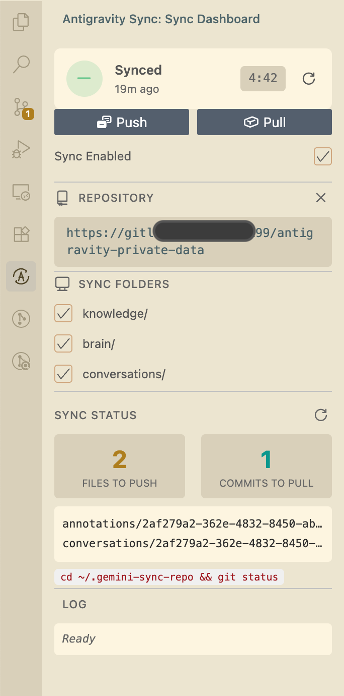

# Antigravity Sync - Retry

> 🇻🇳 **Người dùng Việt Nam:** Xem [README tiếng Việt](README_VI.md) để có hướng dẫn chi tiết bằng tiếng Việt.

[](https://marketplace.visualstudio.com/items?itemName=mrd9999.antigravity-sync)
[](https://open-vsx.org/extension/mrd9999/antigravity-sync)
[](https://opensource.org/licenses/MIT)

**Auto-sync AI context + Auto-accept/retry for AI coding agents. Zero-babysitting automation.**

---

## 👤 About Me

**Dung Le** — Software Engineer from Vietnam 🇻🇳

- 💼 **Facebook:** [@mrd.900s](https://www.facebook.com/mrd.900s)
- 🐙 **GitHub:** [mrd9999](https://github.com/mrd9999)
- 🐧 **VNLF:** [Vietnam Linux Family](https://www.facebook.com/groups/vietnamlinuxcommunity)

---

## Screenshots

| Auto Retry | Sync Dashboard |
|:-----------:|:--------------:|
|  |  |

---

## 🤖 Auto Retry

Automatically click **Retry** buttons when AI agents encounter errors. Zero-babysitting automation!

### How It Works

Uses Chrome DevTools Protocol (CDP) to inject a script that monitors the IDE webview and auto-clicks approval buttons.

### Quick Start

1. Open **Antigravity Sync** panel in sidebar
2. Click **"Start Auto Retry"**
3. First time: Follow setup dialog to enable CDP
4. **Restart IDE** (Quit + Reopen using the command shown)
5. Click **"Start Auto Retry"** again → Active! ✅

### Supported IDEs

- ✅ VS Code
- ✅ Cursor  
- ✅ Antigravity
- ✅ Other Electron-based IDEs

### Platform Support

| Platform | Status |
|----------|--------|
| macOS | ✅ Full support |
| Windows | ✅ Full support |
| Linux | ✅ Full support |

---

## 🔄 Auto Sync

Sync **Gemini Antigravity context** (`~/.gemini/antigravity/`) across machines via private Git repository.

**Problem solved:** When switching machines, all conversation history, Knowledge Items and brain artifacts are lost. This extension auto-syncs via Git to preserve everything.

---

## ⚠️ IMPORTANT: Cross-Machine Sync

### Workspace Path Matching

Antigravity stores conversation history by **absolute workspace path**. To see conversations from the old machine on a new machine, **workspace paths MUST BE IDENTICAL**.

**Example:**
- Machine A: `/Users/dung.leviet/Documents/myproject`
- Machine B: **MUST also be** `/Users/dung.leviet/Documents/myproject`

If paths differ, conversations won't appear even after successful sync.

### Solution: Symlinks

Create symlinks on the new machine to match the old machine's paths:

```bash
# Linux/macOS
sudo mkdir -p /Users/dung.leviet/Documents
sudo ln -s /actual/path/to/project /Users/dung.leviet/Documents/myproject

# Windows (Run as Administrator)
mklink /D "C:\Users\dung.leviet\Documents\myproject" "D:\actual\path\to\project"
```

### Reload Window After Sync

After pulling data from remote, you **MUST reload VS Code window** to load new conversations:

```
Cmd+Shift+P (macOS) / Ctrl+Shift+P (Windows/Linux)
→ "Developer: Reload Window"
```

### OS Compatibility

| Sync between | Works? | Notes |
|--------------|--------|-------|
| macOS ↔ macOS | ✅ | Use symlink |
| Linux ↔ Linux | ✅ | Use symlink |
| Windows ↔ Windows | ✅ | Use `mklink /D` (Admin) |
| macOS ↔ Linux | ✅ | Use symlink |
| macOS/Linux ↔ Windows WSL | ✅ | Symlink in WSL + VS Code Remote |
| **macOS/Linux ↔ Windows native** | ❌ | **Path format incompatible** |

> **Note:** 
> - `knowledge/` and `brain/` work on all platforms without symlink
> - Only `conversations/` needs workspace path matching

---

## Features

- **Auto-sync** — Auto sync changes to private repository
- **Private repo only** — Validate repository must be private
- **Sensitive data protection** — Auto-exclude OAuth tokens and credentials
- **Side panel** — Dashboard showing sync status, files and history
- **Selective sync** — Choose folders to sync
- **Setup wizard** — Step-by-step config

## Installation

### From Marketplace

**VS Code Marketplace:**
https://marketplace.visualstudio.com/items?itemName=mrd9999.antigravity-sync

**Open VSX (for Cursor, VSCodium):**
https://open-vsx.org/extension/mrd9999/antigravity-sync

### From VS Code/Antigravity

1. Open Extensions (`Cmd+Shift+X` / `Ctrl+Shift+X`)
2. Search "Antigravity Sync"
3. Install

### From VSIX

```bash
# If agy is already in PATH:
agy --install-extension antigravity-sync-0.1.1.vsix

# If agy is NOT in PATH, add it first:
# Cmd+Shift+P → "Shell Command: Install 'agy' command in PATH"
# Then run the install command above
```

## Quick Start

1. Create **private Git repository** (GitHub, GitLab, Bitbucket)
2. Generate **access token** with repo scope
   - GitHub: [github.com/settings/tokens](https://github.com/settings/tokens)
   - GitLab: Settings → Access Tokens
   - Bitbucket: App passwords
3. Command Palette (`Cmd+Shift+P` / `Ctrl+Shift+P`)
4. Run `Antigravity Sync: Configure Repository`
5. Follow setup wizard

## Configuration

| Setting | Default | Description |
|---------|---------|-------------|
| `antigravitySync.repositoryUrl` | `""` | Git repository URL (must be private) |
| `antigravitySync.autoSync` | `true` | Auto sync changes |
| `antigravitySync.syncIntervalMinutes` | `5` | Auto-sync interval (minutes) |
| `antigravitySync.syncFolders` | `["knowledge", "antigravity"]` | Folders to sync |
| `antigravitySync.excludePatterns` | `[]` | Additional exclude patterns |
| `antigravitySync.geminiPath` | `""` | Custom path to .gemini |

## Excluded Files (Default)

These files are **never synced** to protect privacy:

| Pattern | Reason |
|---------|--------|
| `google_accounts.json` | OAuth credentials |
| `oauth_creds.json` | OAuth credentials |
| `browser_recordings/` | Large video files |
| `code_tracker/` | Machine-specific data |
| `implicit/` | Workspace indexing |
| `user_settings.pb` | User preferences |

> **Note**: `conversations/*.pb` ARE synced (chat history).

Custom patterns can be added in `.antigravityignore` at `.gemini/antigravity`.

## Commands

| Command | Description |
|---------|-------------|
| `Antigravity Sync: Configure Repository` | Setup or change repository |
| `Antigravity Sync: Sync Now` | Manual sync (push + pull) |
| `Antigravity Sync: Push Changes` | Push local changes only |
| `Antigravity Sync: Pull Changes` | Pull remote changes only |
| `Antigravity Sync: Show Status` | Show sync status |

## Security

> ⚠️ Extension requires Git access token with repo scope.

- Token stored in VS Code Secret Storage
- Only works with **private repositories**
- Sensitive files auto-excluded
- HTTPS only

## Development

```bash
git clone https://github.com/mrd9999/antigravity-sync.git
cd antigravity-sync
yarn install
yarn build
yarn test

# Run extension (dev mode)
agy . && press F5
```

## Contributing

- [Report bugs](https://github.com/mrd9999/antigravity-sync/issues/new?template=bug_report.md)
- [Request features](https://github.com/mrd9999/antigravity-sync/issues/new?template=feature_request.md)
- [Improve docs](https://github.com/mrd9999/antigravity-sync/pulls)

## License

MIT © [Dung Le](https://www.facebook.com/mrd.900s)

---

## Contact

- Facebook: [@mrd.900s](https://www.facebook.com/mrd.900s)
- GitHub: [Issues](https://github.com/mrd9999/antigravity-sync/issues)
